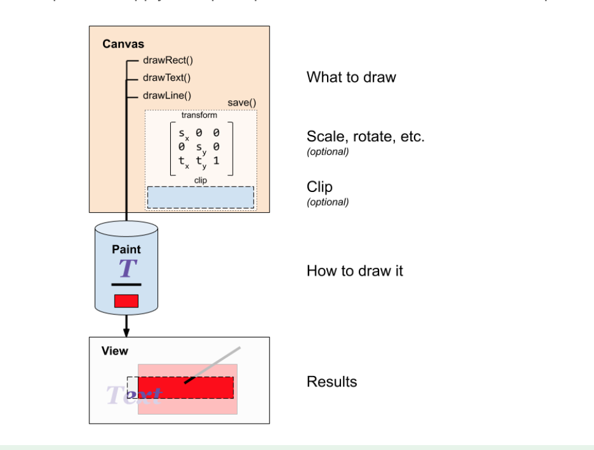

# Custom View Test
Testing custom view and canvas

### Canvas Drawing

**Canvas:** Defines the shapes that you can draw on screen
**Paint:** Defines the color, style, font, and so forth, of each shape you draw
**Path:** Specifies what is been drawn

- When building drawing, you need to cache what you have drawn before. One way of catching data is
with ***bitmap*** or save a history as ***coordinates and instructions***.

- On a caching canvas to draw the caching bitmap

### Graphics interesting stuff
- [Dithering](https://webstyleguide.com/wsg2/graphics/dither.html)
- [quadratic bezier](https://www.sciencedirect.com/topics/engineering/quadratic-bezier-curve) or [Bézier curve](https://en.wikipedia.org/wiki/B%C3%A9zier_curve)
####[Clipping](https://en.wikipedia.org/wiki/Clipping_(computer_graphics))
- is a way to define regions of an image
- selective drawn or not drawn on screen
- reduce overdraw

### Sources
- https://codelabs.developers.google.com/codelabs/advanced-andoid-kotlin-training-custom-views
- https://codelabs.developers.google.com/codelabs/advanced-android-kotlin-training-canvas